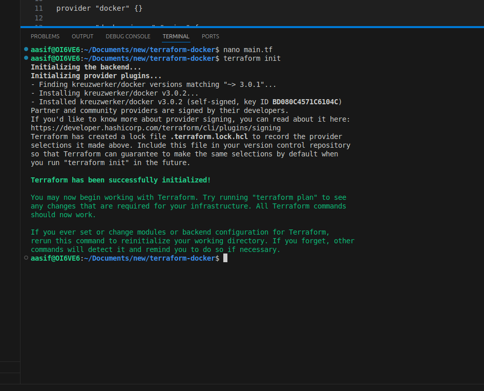

# Terraform IaC Demo

A simple Infrastructure as Code project using Terraform to create local files simulating container deployment.

## What I Built

I created a Terraform configuration that provisions:
- Application configuration file
- Dockerfile for containerization
- Startup script for deployment

## Prerequisites

- Terraform installed
- Basic terminal knowledge

## How I Did It

### 1. Initialize Terraform
```bash
terraform init
```


### 2. Plan the Infrastructure
```bash
terraform plan
```
*Screenshot: terraform-plan.png*

### 3. Apply the Configuration
```bash
terraform apply
```
Type `yes` when prompted.

*Screenshot: terraform-apply.png*

### 4. Check What Was Created
```bash
ls -la
cat app-config.txt
```

### 5. View Terraform State
```bash
terraform state list
terraform state show local_file.config
```
*Screenshot: terraform-state.png*

### 6. Verify Infrastructure (if using Docker)
```bash
docker ps
```
*Screenshot: docker-ps.png*

### 7. Clean Up Infrastructure
```bash
terraform destroy
```
Type `yes` when prompted.

*Screenshot: terraform-destroy.png*

## Files Created

- `app-config.txt` - Application configuration
- `Dockerfile` - Container definition  
- `start.sh` - Startup script

## Outputs

The Terraform configuration provides:
- Paths to all created files
- Application info with port and timestamp

## What I Learned

- How to write Terraform configurations
- Managing infrastructure state
- Using local providers for development
- Best practices for IaC workflows
