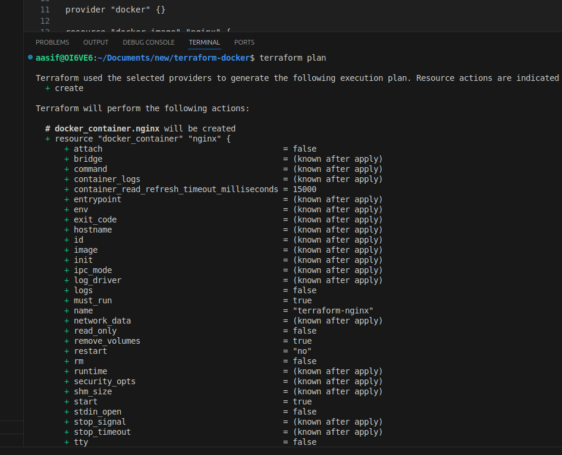
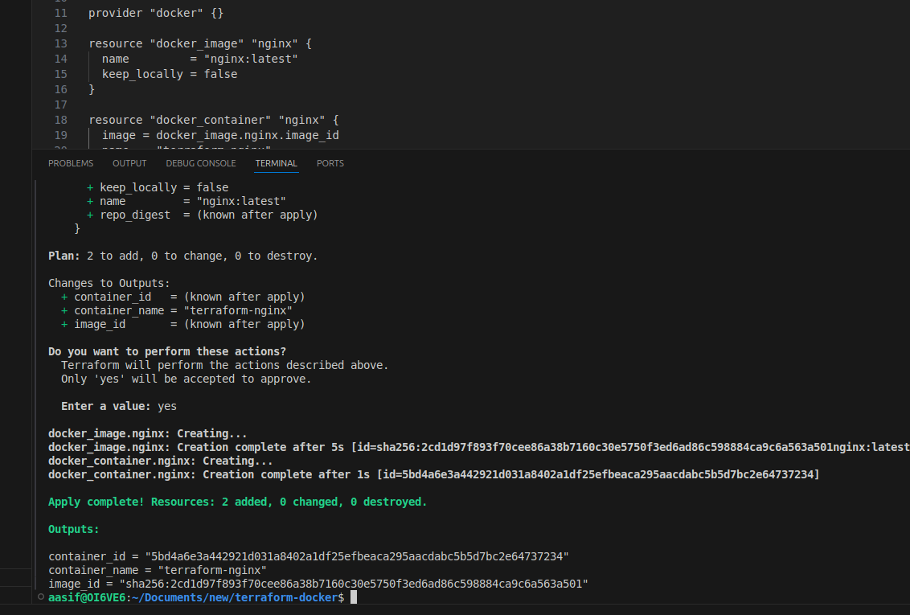
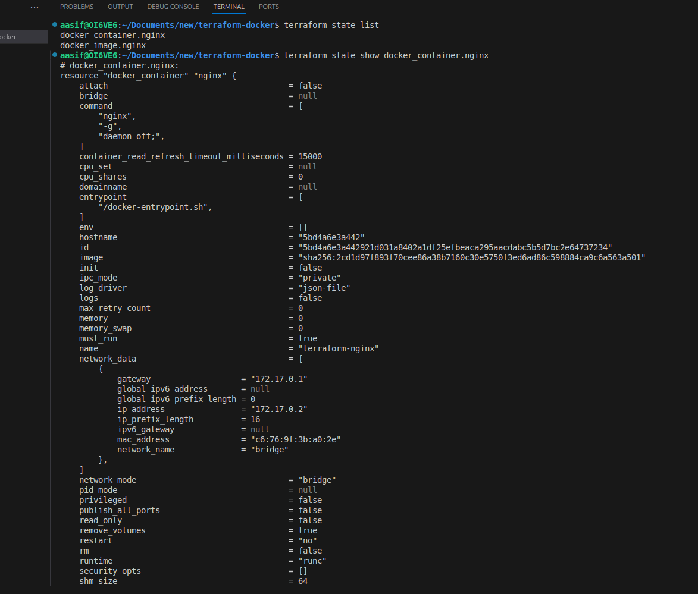
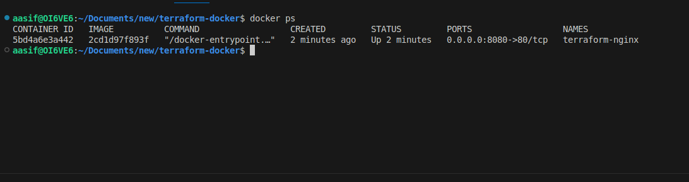
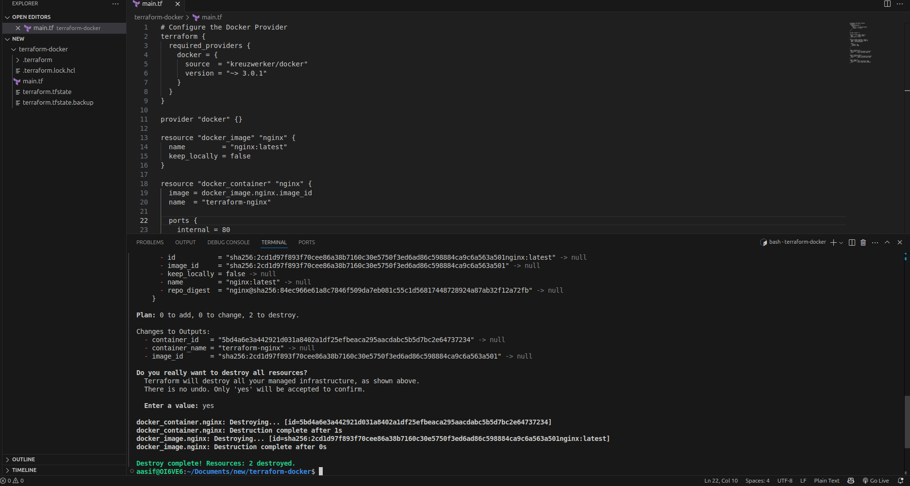
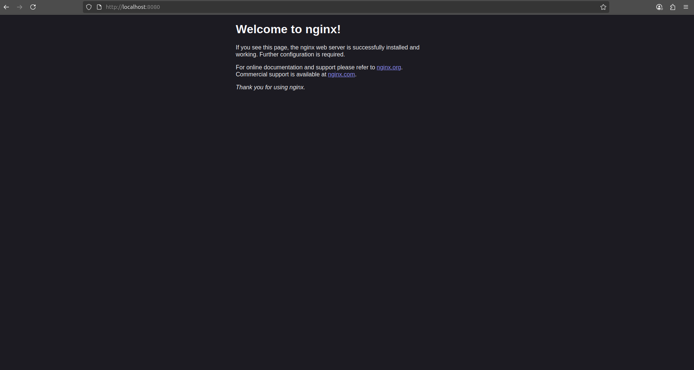

# Terraform IaC Demo

A simple Infrastructure as Code project using Terraform to create local files simulating container deployment.

## What I Built

I created a Terraform configuration that provisions:
- Application configuration file
- Dockerfile for containerization
- Startup script for deployment

## Prerequisites

- Terraform installed
- Basic terminal knowledge

## How I Did It

### 1. Initialize Terraform
```bash
terraform init
```


### 2. Plan the Infrastructure
```bash
terraform plan
```


### 3. Apply the Configuration
```bash
terraform apply
```
Type `yes` when prompted.




### 4. View Terraform State
```bash
terraform state list
terraform state show local_file.config
```



### 5. Verify Infrastructure (if using Docker)
```bash
docker ps
```


### 6. Clean Up Infrastructure
```bash
terraform destroy
```
Type `yes` when prompted.




## Outputs

## Demo App Running on Localhost


The Terraform configuration provides:
- Paths to all created files
- Application info with port and timestamp


## What I Learned

- How to write Terraform configurations
- Managing infrastructure state
- Using local providers for development

